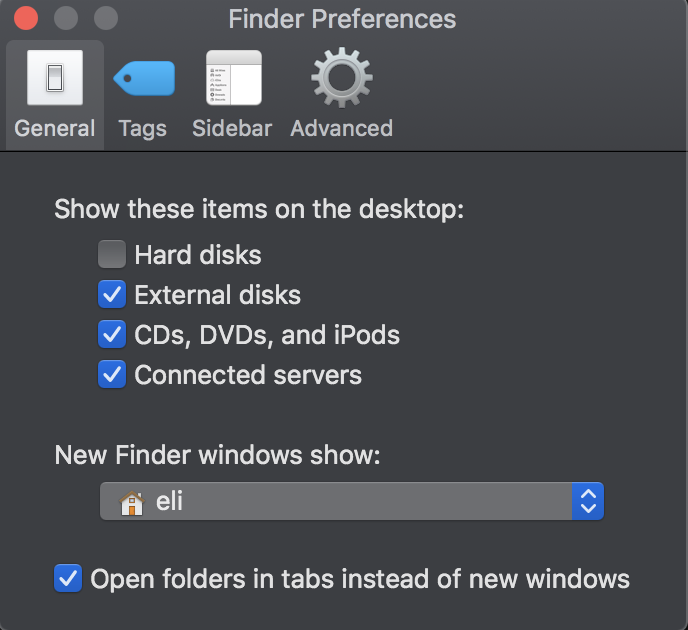
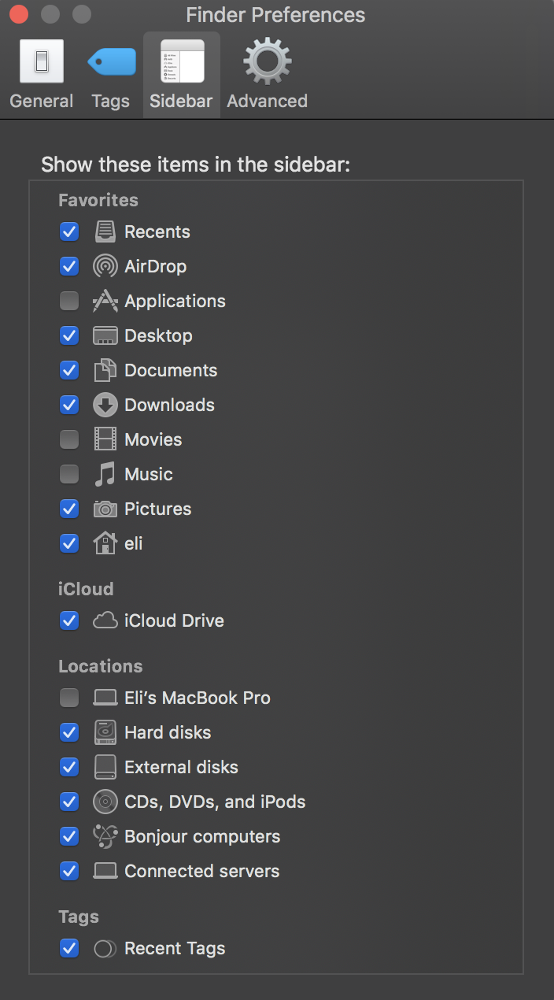
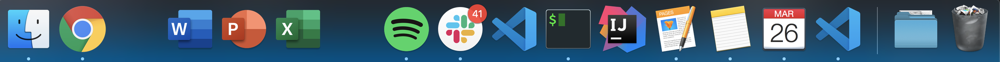
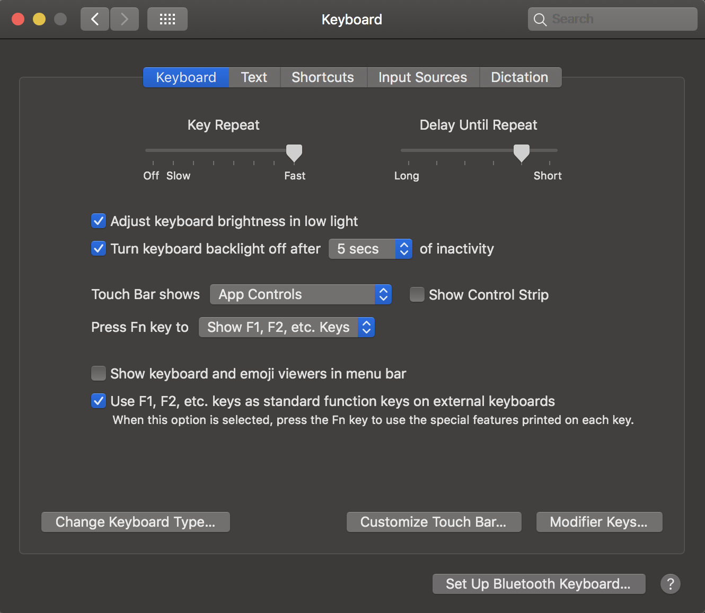

# MacOS Buildout

Repository is based on: [BLOG: Rapid Complete Install / Reinstall OS X Like a Champ in Three-ish Hours](http://www.andrewconnell.com/blog/rapid-complete-install-reinstall-os-x-like-a-champ-in-three-ish-hours)

## Before Paving, document current config

Do the following before paving the partition. This is to get the way I have things configured in the dock & menu bar back the way I want them.

- Set up timestamped backup folder, **{{PRIVATE_BACKUP}}**, Drive (or similar) to copy things
- Screenshot all installed apps
- copy the following => **{{PRIVATE_BACKUP}}**
  > **NOTE:** many of the hidden files & folders are copied as "dot-files"

  - `~/.bash_history`
  - `~/.bash_profile`
  - `~/.gitconfig`
  - `~/.ssh`
  - `~/.zshrc`
  - `~/Desktop`
  - `~/Downloads`
  - `~/Documents`
  - `~/Movies`
  - *review other folders in the root*
- Dev
  - Dump list of all repos in `~/GitHub` => **{{PRIVATE_BACKUP}}**
- Visual Studio Code
  - refresh installed extensions install list: **[./scripts/vscode-ext-install.sh](./scripts/vscode-ext-install.sh)**

      ```bash
      $ code --list-extensions
      ```

  - backup snippets & user settings to **[./AppSettings/VisualStudioCode](./AppSettings/VisualStudioCode)**
    - user settings: `~/Library/Application Support/Code/User`

- Spectactle
    - Shortcuts: `~/Library/Application Support/Spectacle`

- qBitorrent/Karabiner configs:
    - `~/.config `

### MacOS & System

- have a current Apple TimeMachine backup job finished
- screenshots of Finder settings

    

    

- screenshot MacOS dock

    

- screenshot of MacOS Menu Bar

    


- Mac App Store apps
- refresh list installed MacOS apps: **[./scripts/macos-install.sh](./scripts/macos-install.sh)**

    ```bash
    $ mas list
    ```

## Pave partition

1. restart with COMMAND+R
1. when apple logo comes up... delete partition, NOT tiny partition (2nd listed)
1. install MacOS via internet

## Install apps

The following installs & configuration should be done to setup automated installs.

### Homebrew & Homebrew Cask

Install [Homebrew](http://brew.sh/) for automated installs & updates.

```bash
curl -L https://raw.githubusercontent.com/EliZucker/osx-install/master/scripts/homebrew-install.sh | sh
```

### Install apps via Homebrew: `homebrew-install-apps.sh`

Install apps using Homebrew.


> **NOTE**: Monitor the terminal for password prompts & errors/warnings.

```bash
curl -L https://raw.githubusercontent.com/EliZucker/osx-install/master/scripts/homebrew-install-apps.sh | sh
```

### Install Mac App Store apps: `macos-install.sh`

Install apps from the Apple App Store.

```bash
curl -L https://raw.githubusercontent.com/EliZucker/osx-install/master/scripts/macos-install.sh | sh
```

### Manual Installs

- Arduino IDE needs to be installed manually
- Install Muse 4.0 Alpha 1 from [releases](https://github.com/xzzz9097/Muse/releases)

## Configure apps

### Configure core apps to acquire backups, licenses & passwords

- login to the following apps
  - Google Chrome/Drive
    - *do this first to get licenses*
- Visual Studio Code
  - install extensions collected before pave:

      ```bash
      curl -L https://raw.githubusercontent.com/EliZucker/osx-install/master/scripts/vscode-ext-install.sh | sh
      ```

  - copy snippets & settings:
    - from **[./AppSettings/VisualStudioCode](./AppSettings/VisualStudioCode)**
    - to `~/Library/Application Support/Code/User`

- Configure keyboard:
  - Launch Karabiner
  - Then quit and copy configs to `~/.config ` (orignally in AppSettings folder)

- Configure Window Management:
  - Launch Spectacle
  - Then quit and copy shortcuts to `~/Library/Application Support/Spectacle`

### Setup command prompt (iTerm)

Install ZSH, Oh My ZSH, iTerm & copy fonts & themes:

```bash
curl -L https://raw.githubusercontent.com/EliZucker/osx-install/master/scripts/cmdprompt-install.sh | sh
```

Then copy backed up `./.zshrc`
and run this line in a new session:
 ```
conda config --set auto_activate_base False
```

- iTerm
  - import settings from **[./AppSettings/iTerm](./AppSettings/iTerm)**
  - setup SSH keys
    - copy backed up `./.ssh` keys from **{{PRIVATE_BACKUP}}** => `./.ssh`
    - configure SSH keys

        ```bash
        # add key to SSH agent
        ssh-add ~/.ssh/id_rsa

        # add to keychain
        ssh-add -K

        # configure 'config' folder permissions
        sudo chmod 600 ~/.ssh/id_rsa
        ```

### Configure Installed Apps


- Menubar layout:

    

- NordVPN
- Slack
- Register Stay/Fantastical
- 

## Additional downloads & installs Install My Personal Apps: `scripted-installs.sh`

```bash
curl -L https://raw.githubusercontent.com/EliZucker/osx-install/master/scripts/scripted-installs.sh | sh
```

- Creative Cloud installs (currently the only item in list above)
  - Acrobat DC
  - Lightroom CC
  - Photoshop 2020
  - Disable launch on startup!


## Post installation & configuration checks

### Update Homebrew, Homebrew Cask & purge installs

```bash
brew doctor
brew update
brew cleanup
brew cask cleanup
```

### Setup git

> NOTE: This might already be done by copying the hidden **~./.gitconfig**.

```bash
git config --global user.name "Eli Zucker"
git config --global user.email "eli_zucker@brown.edu"
git config --global credential.helper osxkeychain
```

### MacOS Tweaks

- Adjust finder to screenshots above

- System Preferences

  - Dock
      

  - Trackpad

    - Enable tap to click and app-expose

  - Keyboard

      

  - Internet Accounts

      - Everything but mail synced

  - Printers
    - install / add printers

### Data Restore

- Clone select repositories from github => `~/GitHub`
- Copy remaining backed up folders (e.g Downloads, Desktop)

### Setup TimeMachine Backups

Run first backups.

## Ongoing... HOWTO Keep Things Updated

to keep Homebrew installed things update, do this:

  ```bash
  brew update           # download app updated formulas
  brew outdated         # what's old?
  brew upgrade          # upgrade everything locally
  # list all brew casks installed & their versions
  brew cask outdated
  brew cask upgrade
  # cleanup everything
  brew cleanup
  ```

update MacOS apps:

  ```bash
  mas outdated    # what's old
  mas upgrade     # upgrade everything
  ```

update MacOS: [ref](https://developer.apple.com/legacy/library/documentation/Darwin/Reference/ManPages/man8/softwareupdate.8.html)

  ```bash
  softwareupdate --list
  # install things based on the name returned using
  sudo softwareupdate --install [name listed]
  ```
